# UnityTerrainConvertor
## Latest Update 15/04/2025
## Project Architecture
``` bash
├───Assets
│   ├───Prefab #example scene here
│   ├───Scenes
│   ├───Scripts
│   │   ├───MeshCombiner # One Click Mesh Combination coded here
│   │   ├───OBJExporter # One Click Mesh Export coded here
│   │   ├───Export Object Position #One Click waypoint position export coded here
│   │   └───...
│   ├───ExampleResources
│   │   ├───map_v1 #example map here
│   │   ├───isaac_gym_files #example isaacgym terrain files here
...
```
## 1. One Click Mesh Combination
no need to export terrain and reload now!
### 1.1 Place All things you want to combine under a parent gameObject(for example the object called "Map" here)
### here we combine a cube(with mesh) and the terrain
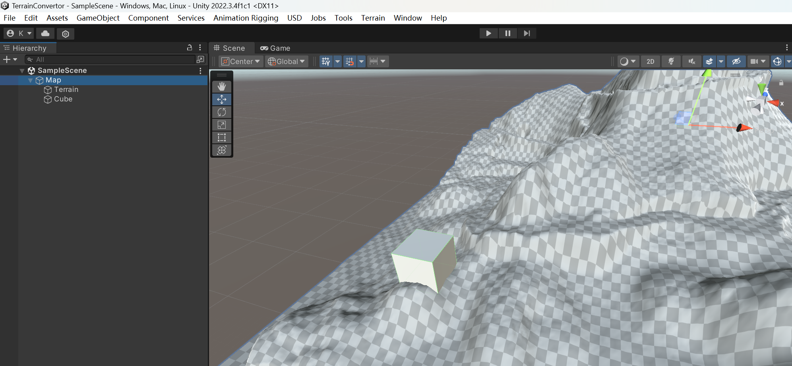
### 1.2 In Menu bar click "Tools" -> "Combine Meshes"(Note the parent gameObject should be selected in hierarchy window)
### 1.3 Then all childs mesh and terrain under that parent object will be combined into one mesh called "CombinedMesh"
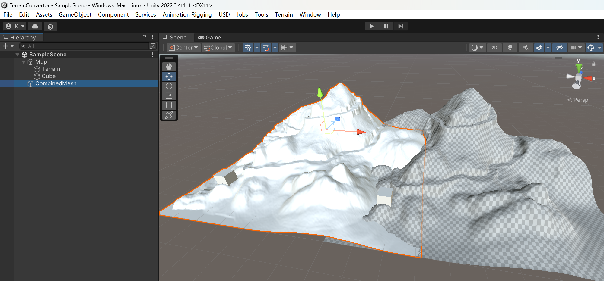

## 2. One Click Mesh Export to .obj File
### 2.0 Select the combined mesh generated
### 2.1 In Menu bar click "Tools" -> "Export Selected to OBJ"(we export using "Export in ROS coordinate" to fit with API in isaac_gym)
### 2.2 Place your .obj file under for example Assets/ExampleResources/map_v1/CombinedMeshes.obj


## 3. One Click Waypoint Pair Export
### 3.0 Under a empty gameObject called "waypoints", create a empty gameObject called "waypoint1" and give it a icon (those name not important)
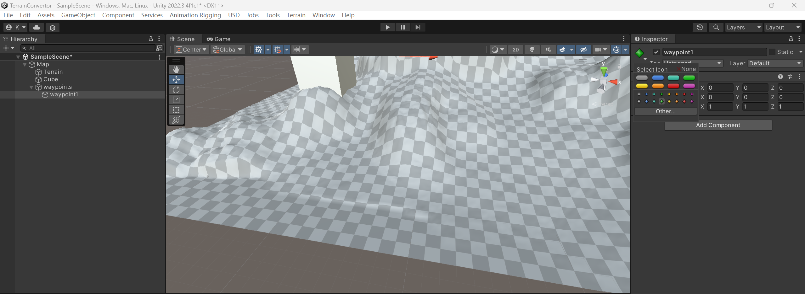
### 3.1 Click Add tag if no tag called "way_point"(tag name is important!!), and assign them with tag "way_point"
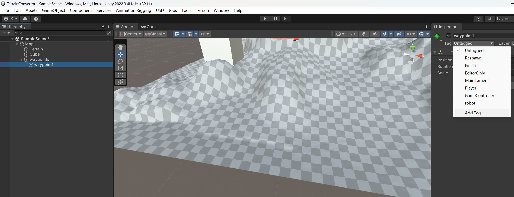
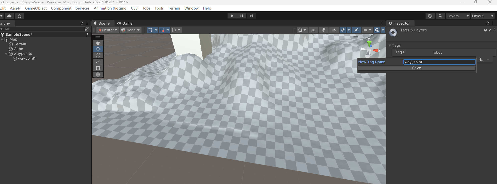
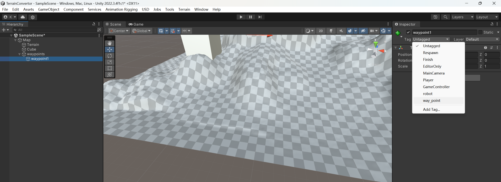
### 3.2 we have two waypoints now and select the parent object , Tools->Export Object Positions
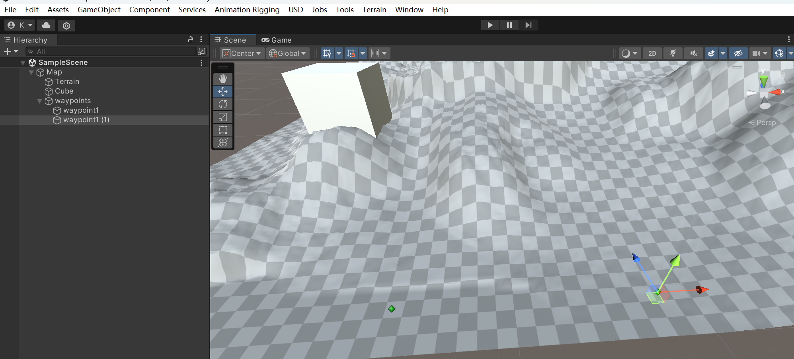
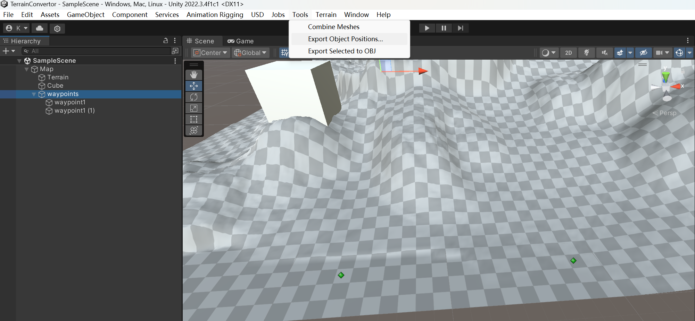
### 3.3 default setting is okay, export under same folder as .obj file Assets/ExampleResources/map_v1/point_set_1.txt
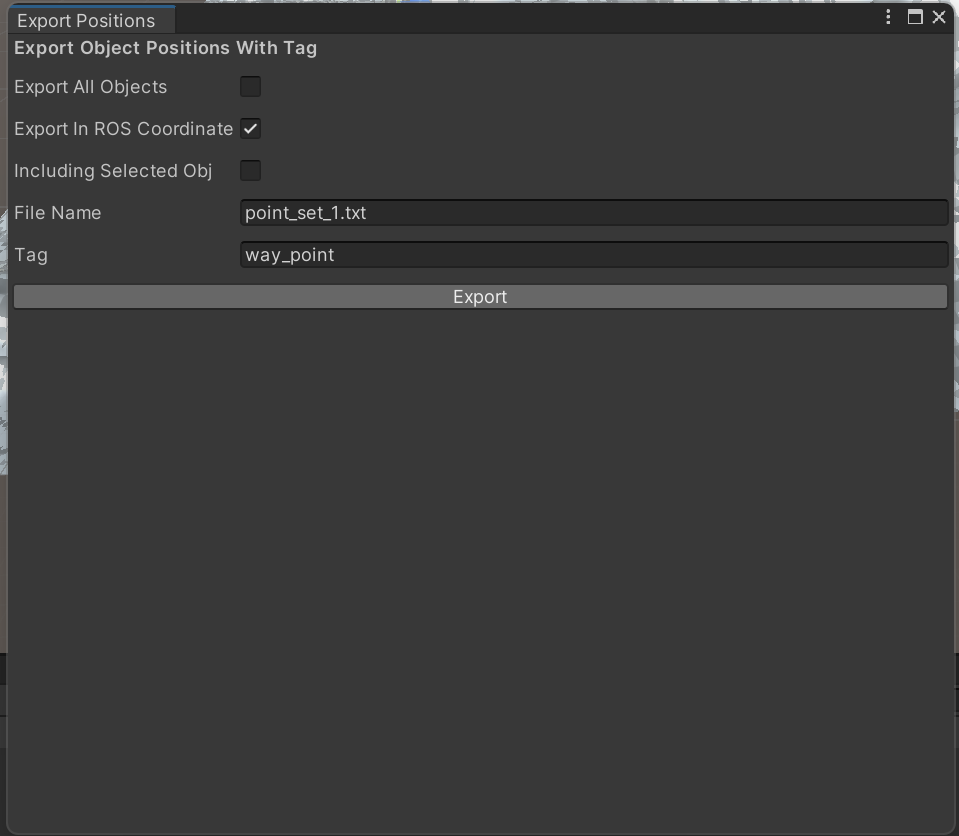
### 3.4 now you can move all things under "map_v1" folder to your isaac gym resources folder!

## 4. isaacGym UnityTerrainModule
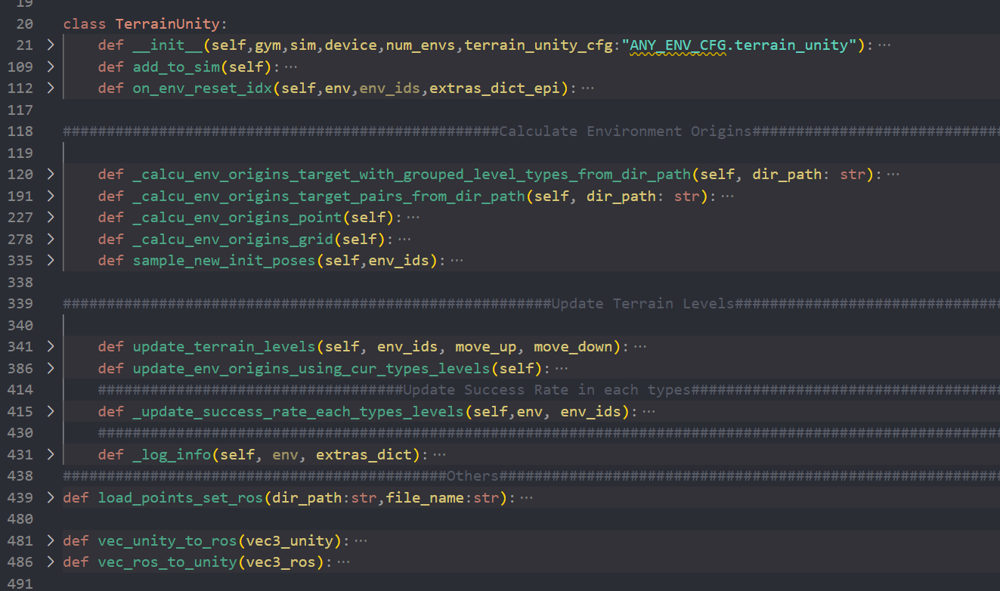
### 4.1 Simple Module Plug-in:
You only need to call "init" "add_to_sim" "on_env_reset_idx" in proper place to set it up
#### 4.1.1 initialize the module and call add_to_sim in legged gym "create_envs" function
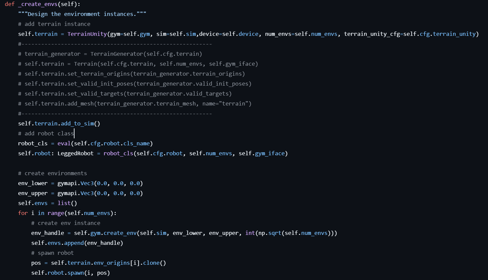
#### 4.1.2 call on_env_reset_idx in reset_idx
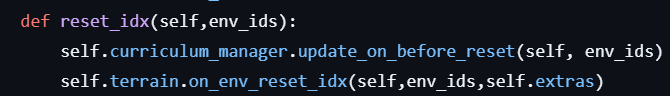
### 4.2 Module Configuration
Here we use "point_pair_files" as environment origin and target pattern, this loads the point pair file we generated before
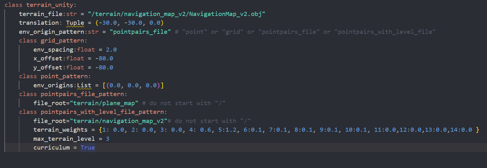
### 4.3 resample target
When resample target, use the goal stored in your terrain module(read from your point pair file)


## 5. About Coordinate Alignment

### 5.1 Why we need to align the coordinate?
 
To better understand this project, you need to know why and how we align the coordinate.

First, when converting a mesh to .obj file, we extract the local coordinate of the mesh vertices: i.e. the coordinate of the vertices relative to mesh object, corresponding code:

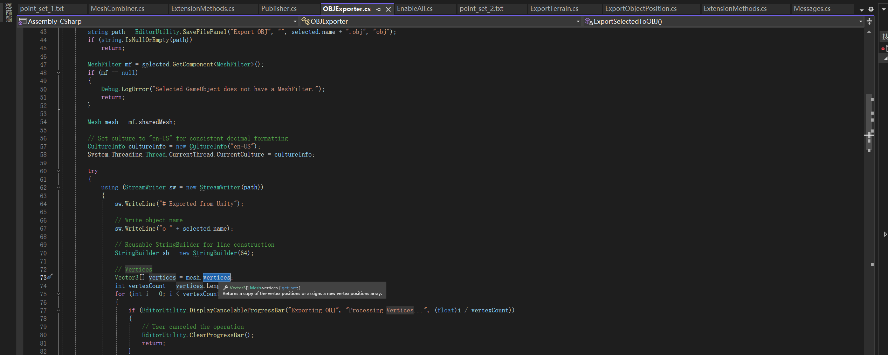


However, when storing the point pair, we store the global coordinate of the points:i.e. the coordinate of the point object relative to world frame.
corresponding code:

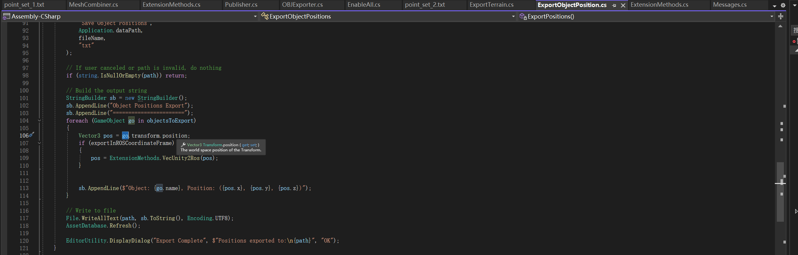

So, when exporting mesh to .obj, you should make sure the mesh coordinate is the same as global world coordinate!

### 5.2 How to check if mesh object coordinate is the same as global world coordinate?


### 5.2.1 Understand Unity Editor Transform in Inspector

The transform in Inspector of an object shows the transform relative to it's parent object

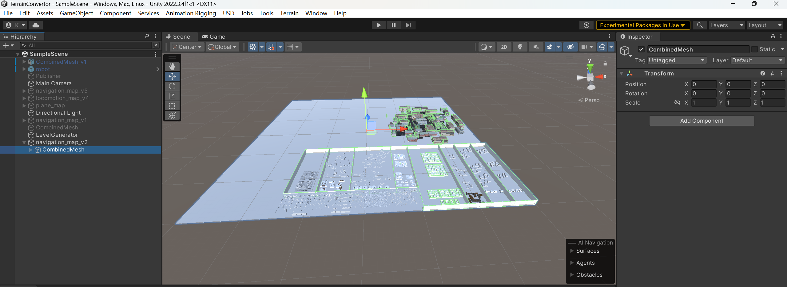
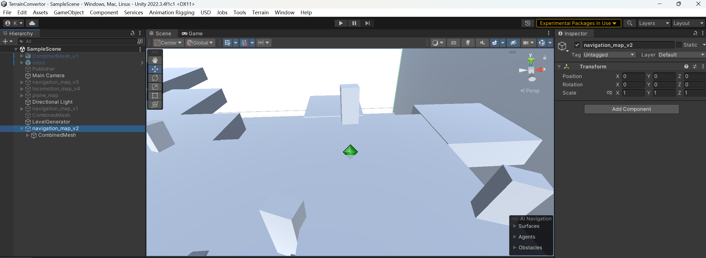

here the parent relation: Scene(world) -> navigation_map_v2 ->CombinedMesh

So we need to make sure the transform of Combined Mesh relative to navigation_map_v2 is zero, and , transform of navigation_map_v2 relative to Scene is zero!


The relative transform of the waypoint is not important, as we read the world coordinate directly in the code. So long as your mesh coordinate align with world coordinate, the waypoint position in world coordinate should be the same as the waypoint position in mesh object coordinate.


