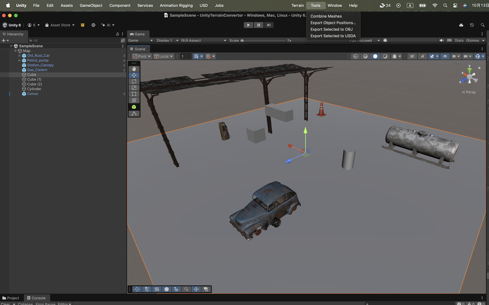
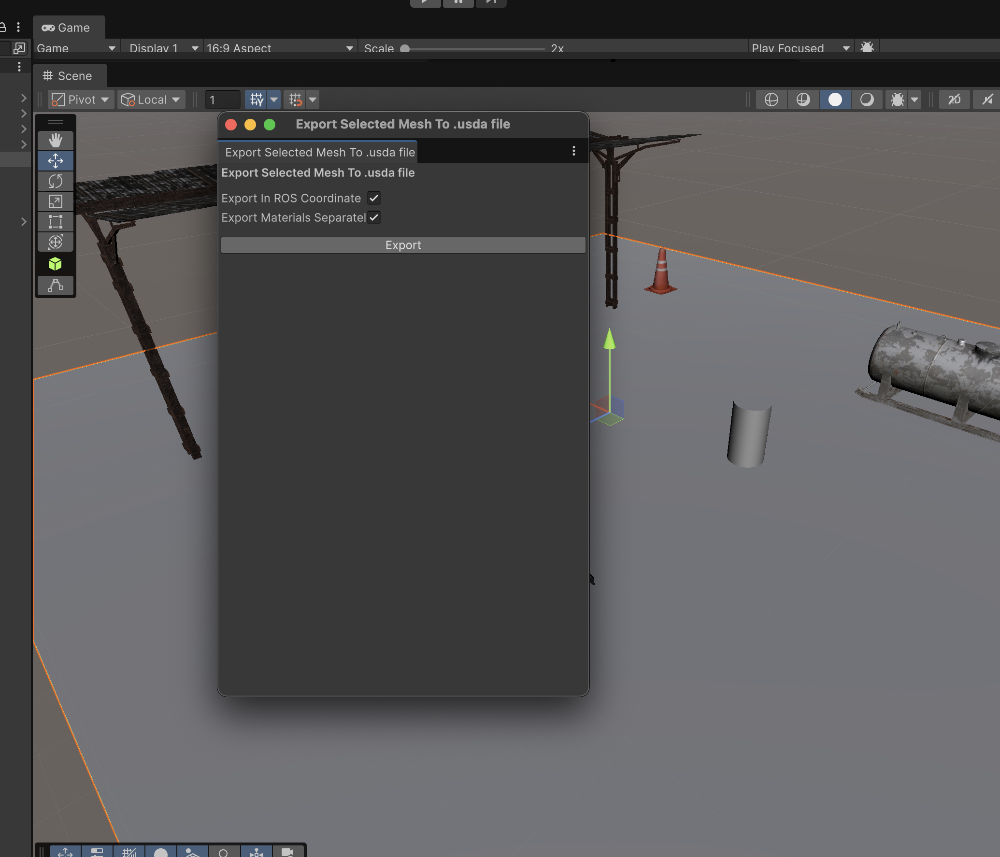
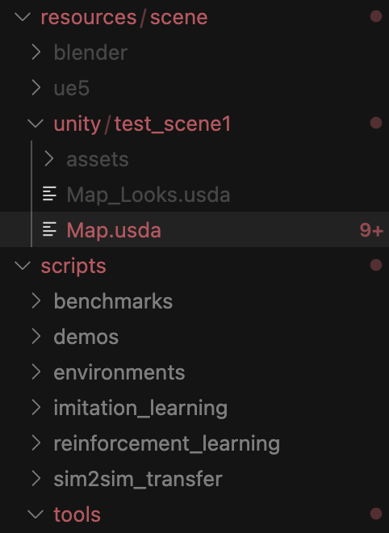
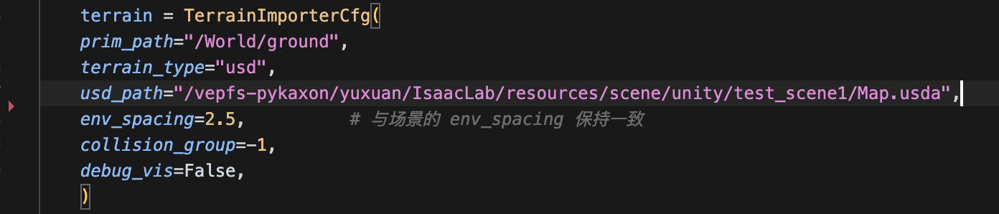
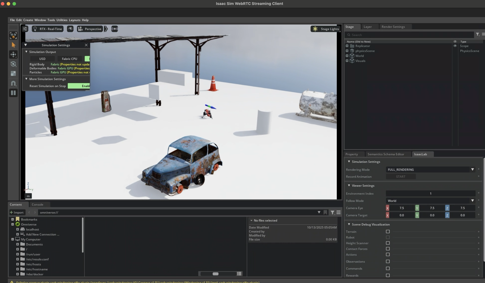

# UnityTerrainConvertor

> **Latest update:** 13&nbsp;Oct&nbsp;2025

---

## Table of Contents  
 [Project Architecture](#project-architecture)  
 
0. [FOR ISAAC LAB(new!): One-Click Mesh + texture export -> usda](#0-one-click-usda-export)  
1. [FOR ISAAC GYM: One‑Click Mesh Combination](#1-one-click-mesh-combination)  
2. [FOR ISAAC GYM: One‑Click Mesh Export → OBJ](#2-one-click-mesh-export-to-obj-file)  
3. [FOR ISAAC GYM: One‑Click Waypoint Pair Export](#3-one-click-waypoint-pair-export)  
4. [FOR ISAAC GYM: Isaac Gym `UnityTerrainModule`](#4-isaacgym-unityterrainmodule)  
5. [FOR ISAAC GYM: Coordinate Alignment FAQ](#5-about-coordinate-alignment)

---

## Project Architecture
```bash
├── Assets
│   ├── Prefab                # ⚙️ Example scene
│   ├── Scenes                # 🎬 Unity scenes
│   ├── Scripts               # 📜 C# utilities
│   │   ├── MeshCombiner          # 1‑click mesh combination
│   │   ├── OBJExporter           # 1‑click OBJ export
│   │   ├── ExportObjectPosition  # 1‑click waypoint export
│   │   └── USDAExporter          # 1-click usda export
│   └── ExampleResources      # 🗺️  Sample data
│       ├── map_v1                # Example map
│       └── isaac_gym_files       # Example Isaac Gym terrains
└── …
```

---
## 0. One-Click USDA Export
1. **Select** the GameObject you want to export.  
2. Click **`Tools → Export Selected to USDA`** and choose **_Export in ROS coordinate_** so the mesh aligns with Isaac Lab.  

3. Export

4. You will see output like that, copy ALL OF THEM to isaaclab, find a folder to past it



5. Change the config in the environment to use this scene



6. Start the isaaclab training, you can see exactly the same scene



## 1. One‑Click Mesh Combination
> **No more exporting & re‑importing terrains!**

1. **Group assets**  
   Put everything you want to combine under a single parent GameObject (e.g. `Map`).

2. **Run the tool**  
   Select that parent in the **Hierarchy**, then choose  
   `Tools → Combine Meshes` from the menu.

3. **Result**  
   A new child called **`CombinedMesh`** appears containing the merged geometry.

| Before | After |
|:--:|:--:|
|  |  |

---

## 2. One‑Click Mesh Export to OBJ File

1. **Select** the `CombinedMesh` GameObject.  
2. Click **`Tools → Export Selected to OBJ`** and choose **_Export in ROS coordinate_** so the mesh aligns with Isaac Gym.  
3. Save the file (e.g. `Assets/ExampleResources/map_v1/CombinedMesh.obj`).

---

## 3. One‑Click Waypoint Pair Export

1. **Create waypoints**  
   Under an empty parent (e.g. `waypoints`) add children named whatever you like (`waypoint1`, …). Give each an icon so they’re easy to see.
2. **Tag them**  
   Add a tag named **`way_point`** (exact spelling) and apply it to every waypoint object.
3. **Export**  
   Select the `waypoints` parent and run `Tools → Export Object Positions` (defaults are fine). The file (e.g. `point_set_1.txt`) is written next to your OBJ.
4. **Move files**  
   Copy the entire `map_v1` folder into your Isaac Gym resources.

| | | |
|:-:|:-:|:-:|
|  |  |  |
|  |  |  |
|  |  |  |

---

## 4. IsaacGym `UnityTerrainModule`


### 4.1 Minimal Integration
Call the three API hooks in your Legged Gym environment:

```c#
// create_envs()
terrainModule.Init(config);
terrainModule.AddToSim(sim);

// reset_idx()
terrainModule.OnEnvResetIdx(envIds);
```

### 4.2 Configuration
Use the **`point_pair_files`** field to load the waypoint file exported above.


### 4.3 Resampling Targets
When resampling, pull goals from the terrain module so everything stays in sync.


---

## 5. About Coordinate Alignment

### 5.1 Why align coordinates?
* Mesh export writes **local** vertex positions.
* Waypoint export writes **world** positions.
* Therefore the mesh’s local axes **must match** the Unity world axes.


### 5.2 How to verify alignment
1. Inspect the **Transform** of your mesh and its parents.  
2. Ensure that every parent up to the Scene has `Position = (0,0,0)` and `Rotation = (0,0,0)`.


If `CombinedMesh` is at the origin in world space, exported OBJ and waypoint files will line up perfectly.

---

### 🚀 Ready to go
* Combine → Export → Tag → Export → Train ✨
* PRs and issues welcome!


